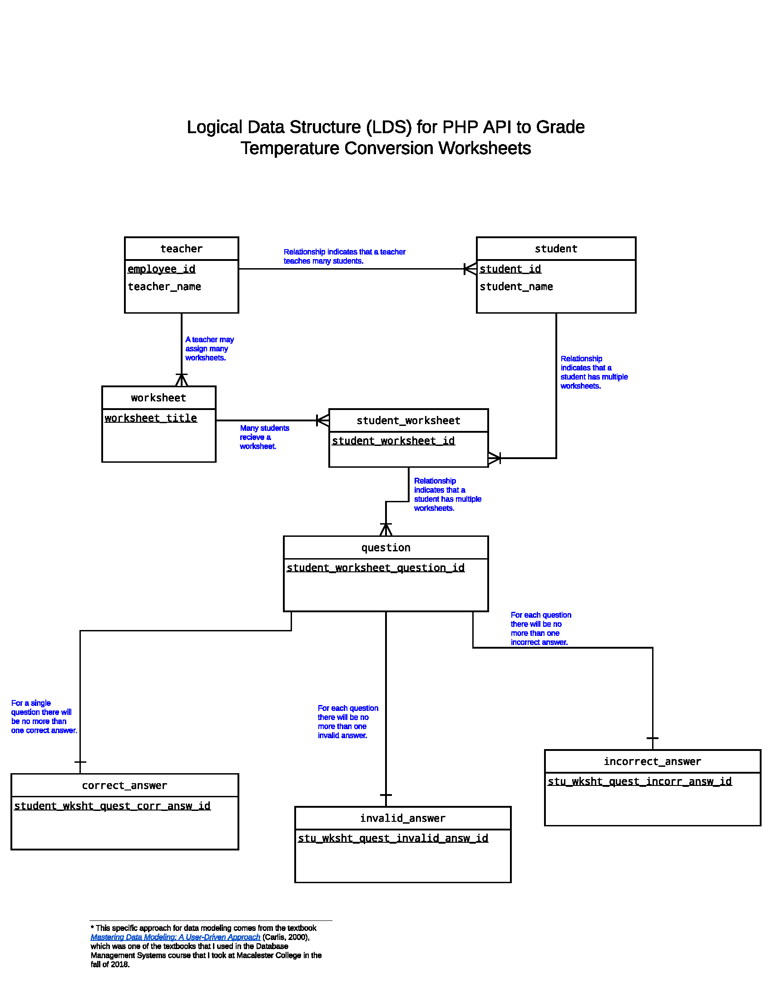
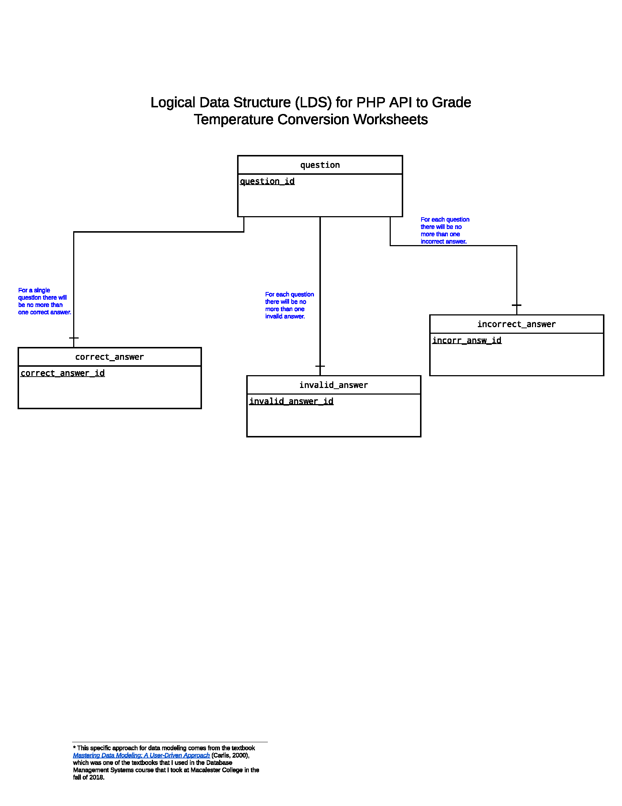
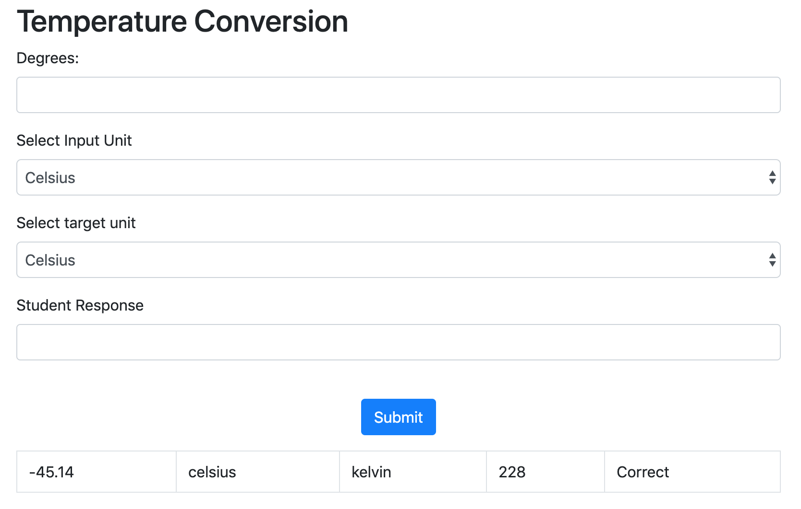

#Temperature Worksheet 

##To run the code: 
1. Download the repository
2. Verify that you have a running php server
3. Open the index.php file through the localhost server

##The state of the project: 
When I started planning the project, I had initially created an Logical Database Structure (LDS), which I realized was significantly more large scale than what would be realistic for the timeline of this project. 

Initially my LDS looked like this: 
 

However, I realized that this was overly ambitious given the timeline and scope for this project. The way it was initially set up would require that there be a separate interface for teachers and students. 

The current LDS like this :

However, given the timeline I was not actually able to setup a database and save records to it. Currently, there is a form that a teacher would fill out and put in the input_temperature, select the input_unit, the target_unit, and the student's response. they would then hit submit and get the answer in a table on the form page. 

In the future, I would expand on this project by connecting to a database and adding a ui for teachers and another ui for students. 
